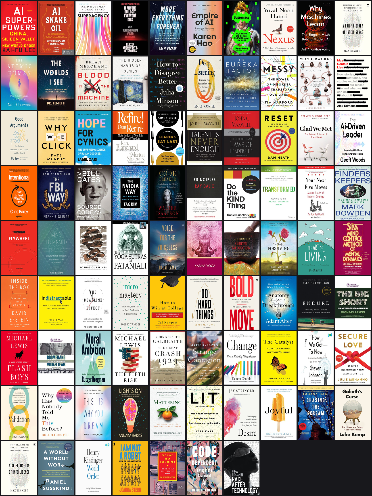
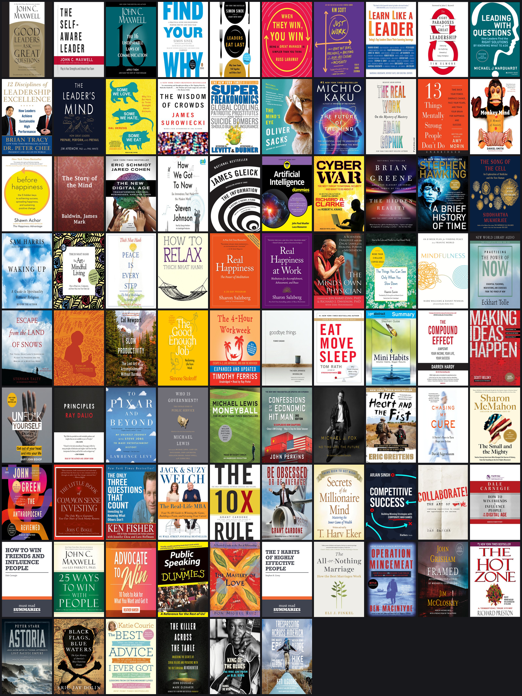

# I read 210 books. An agent picked my next 100 — from my library's shelf.

> 16,450 candidates. 210 priors. 9 themes. One weekend.
> No "you might also like." Just books I can borrow tomorrow.

**Code → [github.com/jnsuryaprakash/book-recommender](https://github.com/jnsuryaprakash/book-recommender)** · Point it at any OverDrive/Libby library + your Anthropic key, get your own 100 picks.

---

## The problem

Goodreads' "for you" feed is junk. It optimizes for popularity, not me. And every rec ends in a friction wall: out of stock, $14.99, or already on my shelf.

I wanted a recommender that **constrains itself to my library's digital collection** — Plano Public Library's Libby/OverDrive — and **grounds itself in my actual read history**. No fantasies. Every pick a one-click borrow.

I had two corpora:
- **The taste signal**: 210 nonfiction books I'd already read, listed on my blog.
- **The candidate pool**: Plano's English-language nonfiction on Libby.

Bridge them with vectors + an LLM curator. Ship.

---

## Architecture

```
┌────────────────────────────┐         ┌────────────────────────────────┐
│  Blogger reading list      │         │  Plano Libby digital catalog   │
│  (HTML)                    │         │  (OverDrive Thunder API)        │
└─────────────┬──────────────┘         └─────────────┬──────────────────┘
              │                                       │
              ▼                                       ▼
       ingest_reads.py                        fetch_catalog.py
       ┌──────────────┐                       ┌──────────────────┐
       │ selectolax   │                       │ httpx + tenacity │
       │ Open Library │                       │ paginated walk   │
       │ Google Books │                       │ subject=111,en   │
       └──────┬───────┘                       └─────────┬────────┘
              │                                         │
              │ data/read.json (210)                    │ data/plano_catalog.json (16,450)
              └────────────────────┬────────────────────┘
                                   ▼
                            embed.py
                            ┌──────────────────────┐
                            │ TF-IDF (sklearn)     │
                            │ ngram=(1,2),40k vocab│
                            │ sublinear_tf, L2     │
                            └──────────┬───────────┘
                                       │ data/vectors.pkl (18MB sparse)
                                       ▼
                                  rank.py
                                  ┌──────────────────────────┐
                                  │ KMeans k=6 over reads    │
                                  │ max cosine vs centroids  │
                                  │ rapidfuzz de-dupe @ 88   │
                                  │ wait-penalty + star boost│
                                  └──────────┬───────────────┘
                                             │ data/ranked.json (top 300)
                                             ▼
                                       rerank.py
                                       ┌────────────────────────┐
                                       │ Claude Opus 4.7         │
                                       │ 41k input / 6.8k output │
                                       │ JSON-only, themed       │
                                       │ ≤3/author, ≤15/theme    │
                                       └──────────┬─────────────┘
                                                  │ data/next_100.json
                                                  ▼
                                            render.py
                                            ┌─────────────────────┐
                                            │ Jinja2 → md + html  │
                                            │ Libby deep links    │
                                            └─────────────────────┘
                                                  │
                                                  ▼
                                         output/next_100.html
```

---

## The five technical pieces

### 1. Scrape your own taste

The reading list lives on Blogger as a flat `<ol>` of `<li>Title – Author</li>` items, with a Telugu section appended at the end. Two-line parser:

```python
telugu_idx = re.search(r"\btelugu\s*:?\s*<", body_html, re.I)
english_html = body_html[: telugu_idx.start()] if telugu_idx else body_html
```

Per title, hit **Open Library** for subject codes + description; fall back to **Google Books**. 210 books, ~3 min, throttled at 400ms.

### 2. Walk the catalog (the undocumented bit)

Libby's web UI talks to `thunder.api.overdrive.com/v2/libraries/{lib}/media`. Not in the developer portal. Discovered the right params by reading the wire:

```python
params = {
    "format": "ebook-overdrive",   # also: audiobook-overdrive
    "subject": "111",               # numeric ID, NOT "Nonfiction"
    "language": "en",
    "perPage": 96,                  # API max
    "page": page,
}
```

The `subject` facet uses numeric IDs (`111` = Nonfiction). The `Subject=Business` name strings the docs would suggest? **400 Bad Request.** The schema gotchas cost me 20 minutes of "why is everything failing."

Total English nonfiction at Plano: **9,615 ebooks + 6,835 audiobooks = 16,450 unique titles** after dedupe.

### 3. Embed locally — TF-IDF beats Voyage for this

I skipped vector databases entirely. With 210 reads and a focused 16k corpus, **TF-IDF + cosine** is surprisingly competitive against modern embedding models — at $0 and ~1 second of compute.

```python
vec = TfidfVectorizer(
    max_features=40_000, ngram_range=(1, 2),
    stop_words="english", min_df=2, max_df=0.85,
    sublinear_tf=True,
)
vec.fit(read_docs + cat_docs)
```

40k vocab, 18MB sparse pickle. Done.

### 4. Rank with k-means centroids (not a single mean)

The naive move is to average all your read vectors into one centroid. That **flattens niche interests**: my Krishnamurti and Adyashanti reads get drowned by the leadership-book mass.

Fix: **k-means(k=6) over the reader's vectors**, then score each candidate by the *max* cosine to any centroid:

```python
km = KMeans(n_clusters=6, random_state=42).fit(read_vecs.toarray())
centroids = l2_normalize(km.cluster_centers_)
sims = cat_vecs @ centroids.T          # (16450, 6)
scores = sims.max(axis=1)              # best-fit centroid wins
```

Add a wait-time penalty (holds/copies) and a tiny star-rating boost to break ties. Fuzzy de-dupe with `rapidfuzz` at token-sort ratio ≥88 to catch "AI Super Powers" vs "AI Superpowers." Output: top 300.

### 5. Let Opus curate

Pure embedding similarity gives you "more of the same author, ranked by popularity." That's not what a librarian does.

Hand the top 300 + a compact taste profile to **Claude Opus 4.7** with strict constraints:

```
- Pick exactly 100. Group into 8–10 themes (≤15 each).
- ≤3 per author. Mix hits with under-the-radar.
- Use ONLY titleIds from the pool. Never invent.
- One sentence "why" per pick, tied to specific prior reads.
```

41k input tokens, 6.8k output, ~30 seconds. JSON out, hydrated back against the candidate metadata so every titleId resolves to a real Libby link.

---

## The bugs that mattered

- **Walmart's MITM proxy** broke every HTTPS call. `pip install truststore; truststore.inject_into_ssl()` — uses the macOS keychain, two lines, done.
- **Thunder API rejects** valid-looking params: `format=ebook` → 400. Only `ebook-overdrive` works. `perPage=120` → 400. Cap is 96.
- **Telugu section detection** failed against `<strong>` because the marker was actually `<div>Telugu:</div>`. Regex `\btelugu\s*:?\s*<` caught both.
- **Claude Opus 4.7 deprecated `temperature`.** Just drop the parameter.
- **Sparse × dense matmul** returns a numpy `matrix`, not a sparse matrix. `np.asarray(...)` before `.max(axis=1)`.

---

## The shelf (all 87 picks)



*10×9 grid. Top rows: AI futures and critiques. Middle: leadership, decision-making, founders. Bottom: meditation, relationships, big history. Every cover is one click to borrow.*

---

## Same pipeline, second library

Once the pipeline was library-agnostic (`--library <key>`), pointing it at **Bentonville Public Library** (`lib2go`) took zero code changes — just a different OverDrive key.



| | Plano (TX) | Bentonville (AR) |
|---|---|---|
| Catalog size | 16,450 | 7,379 |
| Final picks | 87 | 86 |
| Themes | 9 | 9 |
| Compute | ~12 min | ~3 min |

Different shelves, same reader, mostly-different picks. The model leaned harder into operator biographies and communication skills at Bentonville (a smaller catalog forces it to dig deeper into the long tail) and more into AI critiques at Plano (where the AI-futures section is fatter). That's the right behavior.

---

## Try it on your library

```bash
git clone https://github.com/jnsuryaprakash/book-recommender
cd book-recommender && python3.11 -m venv .venv && source .venv/bin/activate
pip install -e . && cp .env.example .env

# Edit .env — set ANTHROPIC_API_KEY and LIBRARY_KEY
# Find your key at libbyapp.com/library/<KEY>

python -m scripts.run --library <YOUR_KEY>
open output/<YOUR_KEY>/next_100.html
```

Swap in your own reading list by either editing `ingest_reads.py` for your source or writing `data/read.json` directly. The rest of the pipeline doesn't care where reads came from.

---

## Results

| Metric | Value |
|---|---|
| Reads parsed | 210 |
| Catalog walked | 16,450 |
| Candidates ranked | 300 |
| Final picks | 87 (Claude self-edited from 100) |
| Themes | 9 |
| Author cap | mostly held (max 4× Michael Lewis) |
| Time end-to-end | ~12 min compute + ~30s LLM |
| Cost | Claude Opus call only |

Themes the model surfaced (unprompted, from my taste alone):

1. **AI Futures and Critiques** — *Kai-Fu Lee continuation + a Yudkowsky counterweight*
2. **Decision-Making and Cognitive Bias** — *Gladwell/Duhigg adjacencies*
3. **Leadership and Management** — *Blanchard + Maxwell + Sinek extensions*
4. **Founders and Operators**
5. **Meditation and Contemplative Wisdom** — *Buddhist + Vedantic + Stoic*
6. **Productivity and Deep Work**
7. **Markets, Money, and Society**
8. **Psychology of Relationships and Self**
9. **Big History and Civilization** — *Harari-adjacent*

Sample pick:

> **AI Snake Oil** — Sayash Kapoor
> *A skeptical counterweight to the AI hype you've been absorbing in 'AI First, Human Always'.*

That's an LLM doing actual *taste arbitrage*, not vector similarity.

---

## What I'd do next

- **Hoopla as second source** — no holds queues; better for impatient borrowing.
- **Monthly cron** — diff catalog; email me the new arrivals that match.
- **Feedback loop** — thumbs up/down per pick, retrain centroids.
- **Cross-lingual sibling** — my Telugu reads deserve their own embedder.
- **Goodreads/StoryGraph CSV ingest** for users without a blog.

---

## Punchline

A weekend, 700 lines of Python, $0.40 of Opus, and one undocumented API later — a recommender that **only suggests books I can actually borrow**, grounded in **the books I've actually read**, themed by **what I actually care about**.

The world doesn't need another "you might also like." It needs personal pipelines.

```bash
git clone … && python -m scripts.{ingest_reads,fetch_catalog,embed,rank,rerank,render}
open output/next_100.html
```
